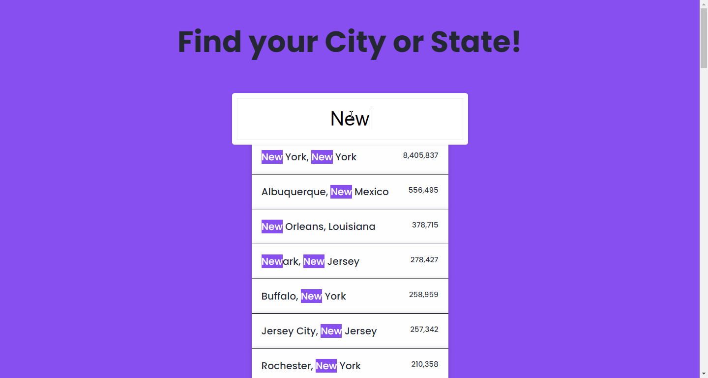

# An autosuggestion based searching system

## Table of contents

- [Overview](#overview)
  - [The challenge](#the-challenge)
  - [Screenshot](#screenshot)
  - [Links](#links)
- [My process](#my-process)
  - [Built with](#built-with)
  - [What I learned](#what-i-learned)
  - [Continued development](#continued-development)
  - [Useful resources](#useful-resources)
- [Author](#author)
- [Acknowledgement](#acknowledgement)

## Overview

### The challenge

User should be able to search a city or state by keyword or name. It will complete the rest.

### Screenshot



- Solution URL: [Git Repo](https://github.com/moeen-mahmud/searching-with-autosuggestions)
- Live Site URL: [Live Site](https://searching-with-autosuggestions.vercel.app/)

## My Process

### Built With

- HTML5 markup
- JavaScript
- Document Object Model
- API

### What I learned

I learned a handfull of array methods by doing this project. I've implemented a simple searching system with auto-completion. Let me demonstrate the function:

```javascript
function findMatches(wordToMatch, cities) {
  return cities.filter((place) => {
    const regex = new RegExp(wordToMatch, "gi");
    return place.city.match(regex) || place.state.match(regex);
  });
}
```

### Continued Development

This project is from [Wes Bos's 30 JavaScript](https://javascript30.com/) course. It is the sixth one.

### Useful resources

- [Mozilla Developer Network](https://developer.mozilla.org/en-US/)
- [JavaScript 30](https://javascript30.com/)

## Author

- Twitter - [moeen_mahmud](https://twitter.com/moeen_mahmud)

## Acknowledgement

A huge thanks to [Wes Bos](https://javascript30.com/).
